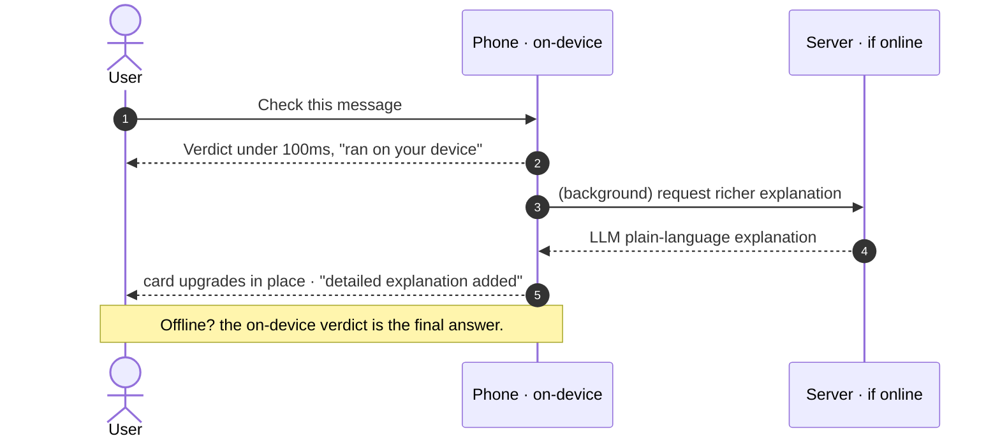

<div align="center">



<br/>


**A scam guardian that runs the _real_ detector on your phone — in your language, even with no internet.**

[**🔗 Live demo**](https://dhanrakshakai.netlify.app) · [Backend docs](backend/README.md) · [Frontend docs](frontend/README.md)

</div>

---

## What it does

You paste or forward a suspicious **SMS, WhatsApp message, link, screenshot, or call recording**. DhanRakshak tells you — in **Gujarati, Hindi, or English** — whether it is a scam, **why** (with the exact words highlighted), how risky it is (0–100), and **what to do next**, including the government's `1930` helpline. It also has a **practice mode**: a fake scam caller you can rehearse saying "no" to.

The catch that makes it different: the detection engine doesn't live on a server you have to reach. **It runs on the phone, in the browser, offline.**

<div align="center">

| 🛡️ Real engine on-device | 📴 Works offline | 🇮🇳 Gujarati-first | 🎧 Practice mode |
|:---:|:---:|:---:|:---:|
| The full detector, not a cut-down copy — verified 26/26 against the server | Opens and answers in aeroplane mode, ~649KB | UI, verdicts & advisories in gu / hi / en | Rehearse a scam call that reacts to what you say |

</div>

## Why it exists

Last October the Prime Minister warned the whole country about **"digital arrest"** scams on Mann Ki Baat — fake police who threaten arrest to extort money. Losses run into hundreds of crores, and the people who lose the most are **first-time, elderly, and rural users** who just got a smartphone and a bank account. The scam-checkers that already exist are English-only, need the internet, and assume a tech-savvy user. Rural Gujarat — patchy signal, low digital literacy, Gujarati speakers — is left out. That is exactly who we built for.

## How it works

### System at a glance

<div align="center">

</div>

> The **same** detection engine runs in two places: on the phone (offline-first, answering in under 100ms) and — only if you're online — on the server, which adds a fuller plain-language explanation on top of the verdict the phone already gave.

### The detection pipeline

Four independent checks read every message at once, and none overrules the others. They are fused with a **noisy-OR**, so one strong signal (a poisoned link, a UPI PIN trap) can raise the alarm on its own.

<div align="center">

</div>

**Precision matters as much as recall.** The classifier is trained on public spam and can misread terse Indian bank SMS. So a **transaction-alert recognizer** vetoes its vote when a message is a genuine debit / credit / balance / OTP notice **and** no rule, link, or UPI-trap fired — a real *"INR 280 debited … Axis Bank"* reads **safe**. It can only ever mute a lone, over-confident classifier; a scam dressed as an alert (a phishing link, "call and share your OTP") still trips a real signal and stays flagged. Crying wolf on the messages banks send all day is exactly what teaches people to ignore a warning.

### Local-first: instant on-device, then upgraded

The verdict never waits on the network. The on-device engine answers immediately; if you happen to be online, the server adds a fuller plain-language explanation that **upgrades the card in place**. Honest little labels always say what actually ran — we never pretend the AI answered when it didn't.



### The degradation ladder — nothing ever dead-ends

The live link must never break. The API returns a complete answer in every tier; an outage upstream costs wording quality, never the verdict.

| Tier | What it does | Depends on | If it fails |
|:---:|---|---|---|
| **1** | Verdict, risk score, evidence spans | nothing — pure Python, in-memory | cannot fail |
| **2** | Advisory snippet via in-process BM25 | nothing — no network, no vector DB | returns no advisory |
| **3** | Plain-language explanation | LLM provider, 8s hard budget | pre-written templates in gu / hi / en |

## Proof it works

We didn't just claim the phone matches the server — we tested it.

- **On-device parity: 26 / 26.** Twenty-six test messages sent through both engines; every verdict label matches and every risk score lands within **±5 points**. The fixtures are the *real server engine's* output, regenerated on every model export, so the phone can never quietly drift from the server.
- **Precision on real bank SMS: 147 / 147.** A labelled corpus of 147 messages (76 genuine bank alerts + 71 scams, across gu / hi / en) scores **precision 1.0 and recall 1.0** — no false alarm on a real debit/credit/OTP notice, no scam let through. Grows on every lexicon change (`scripts/eval_corpus.py`).
- **Real offline test.** A headless-Chrome run loads the app once online, switches the network **off**, reloads, and confirms a full verdict still renders — in **both English and Gujarati**, with highlights and the "ran on your device" chip. The install is resilient: the service worker precaches each asset best-effort and **guarantees the shell essentials**, so one dropped byte on a rural link never leaves the app un-openable offline (`npm run verify:offline`).
- **96 backend + 37 frontend tests**, all green. Typed, small modules.
- **Privacy by design.** Messages are analysed and never stored; an offline check never leaves the device.

> **Honest note.** The public demo runs on a free server tier (~a tenth of a CPU), so server-side screenshot OCR is slow there. On a laptop or a paid instance it is near-instant, and the on-device checks are always fast because they never leave the phone.

## Tech stack

| Layer | Choices |
|---|---|
| **Frontend** | Next.js (static export) · TypeScript · Tailwind · PWA (service worker + Web Worker) |
| **On-device engine** | TypeScript port of the server engine · TF-IDF + LightGBM (tree JSON) · ~195KB gzipped |
| **Backend** | FastAPI · Python 3.11 · Pydantic v2 |
| **AI / ML** | scikit-learn + LightGBM (detection) · Groq LLM (explanations, voice) · Tesseract OCR · edge-tts |
| **Deploy** | Netlify (frontend) · Render (backend, Docker) |

## Run it locally

Everything runs at full speed on a laptop (screenshots included).

```bash
# 1 · backend  (needs backend/.env with GROQ_API_KEY)
cd backend
../.venv/bin/uvicorn app.main:app --reload --port 8000

# 2 · frontend  (uses .env.local → NEXT_PUBLIC_API_URL=http://localhost:8000)
cd frontend
npm run build:worker && npm run dev      # http://localhost:3000
```

## Works offline after the first online visit

**One online visit is all it takes.** On that first load the service worker precaches the
whole shell — every route, JS/CSS chunk, font, the i18n dictionaries, the on-device engine
artifacts, the persona pools and the icons (~649KB gzipped, budget 1.5MB). After that the app
opens and works with **zero network**: the shell loads, language switching works, the analyzer
runs a full on-device verdict with highlights, sample chips work, and text-mode practice works.
A quiet **"Offline — instant checks still work"** indicator appears; screenshot/voice features
(which need the server) degrade with a clear note. When a new version deploys, a subtle
**"App updated — refresh"** toast appears and the old cache is cleaned on refresh — never a
stale-forever app.

> Why a static site normally *doesn't* open offline: reopening it makes a **navigation request**
> that hits the network and fails. Our worker answers navigations from the cached shell instead,
> so the app always opens — App Router then routes client-side from cache.

<details>
<summary><b>Judge demo — prove it in 60 seconds</b></summary>

<br/>

**On a phone (the real test):**
1. Open **https://dhanrakshakai.netlify.app** once with internet. Wait ~5–10s (the shell is caching).
2. Optional: **Add to Home Screen** from the browser menu — it installs as an app.
3. Turn on **Airplane mode**.
4. Reopen the site (or tap the installed icon). It opens — no dinosaur, no blank screen.
5. Paste a scam (e.g. *"Your account will be blocked. Enter your UPI PIN to receive ₹5000."*) → tap **Check** → full verdict, risk score, highlighted evidence, and the chip reads **"ran on your device."**

**On a laptop (DevTools):**
```bash
cd frontend
npm run build && npx serve out -l 3000
# open http://localhost:3000 once, then DevTools → Application → Service Worker
# (shows "activated"; the precache list includes /engine/*), then
# DevTools → Network → Offline → reload → paste a scam → full verdict, chip = on-device
```

**Reproduce the automated proof** (real headless Chrome, online→offline→reload→analyze):
```bash
cd frontend && npm run build
# serves the export Netlify-style and drives real Chrome through the offline flow
node scripts/verify-offline.mjs      # prints VERDICT for English and Gujarati
```

</details>

## Repo layout

```
dhanrakshak/
├── backend/              FastAPI: detection, explainer, simulator, OCR/STT
│   ├── app/detection/    rules · urls · upi · TF-IDF+LightGBM · fusion
│   ├── app/explain/      BM25 advisories · LLM providers · templates
│   ├── app/simulator/    scam-call practice: personas · coach · voice
│   └── scripts/          export_client_model.py → ships the engine to the browser
├── frontend/
│   └── src/lib/engine/   the faithful TypeScript port + parity tests
├── docs/                 README assets (animated hero)
└── render.yaml           one-command backend deploy
```

## Credits

Built for the **MAVERICK AI Challenge** (Dewang Mehta Foundation · GTU). Scam patterns and advisories are grounded in official guidance from **RBI, NPCI, and the Indian Cyber Crime Coordination Centre (I4C)**. National cyber-crime helpline: **1930** · [cybercrime.gov.in](https://cybercrime.gov.in).

<div align="center">
<br/>
<sub><b>Check before you trust.</b></sub>
</div>
